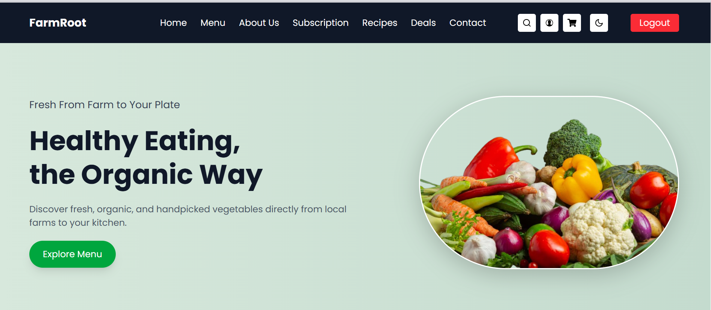

##### 🌾 FarmRoot - React E-commerce Application
FarmRoot is a modern, responsive e-commerce web application built using React and Tailwind CSS. It provides a seamless shopping experience with features like product browsing, cart management, order checkout, and a beautiful light/dark mode toggle.

🌐 Live Demo: https://organic-food-farmroot.vercel.app

#### 🚀 Features
🛍 Product Listing & Details
Browse a variety of organic products with images and descriptions.

🛒 Add to Cart
Add items to a persistent cart stored in localStorage.

🧮 Cart Management
View and update item quantities, or remove items before checkout.

📦 Checkout Form
Collect and validate user information before placing an order.

🔐 User Authentication
Login, signup, and logout features using localStorage for session handling.

🧭 Responsive Navbar
Clean navigation UI with dropdowns and mobile-friendly hamburger menu.

🌗 Dark Mode Support
Easily toggle between light and dark themes with smooth transitions.

🔎 Search Functionality
Quickly search for products from the navbar.

🎉 Animations & Feedback
UI animations and toast notifications for better UX.

#### 🛠 Tech Stack
Frontend: React (with Hooks), React Router DOM

Styling: Tailwind CSS (with dark mode)

Icons: React Icons

Notifications: React Toastify

Storage: localStorage


##### 📦 Installation
1. Clone the Repository
   ```bash
   git clone https://github.com/yourusername/farmroot.git
   ```

2. Install Dependencies
   ```bash
   npm install
   ```

3. Start Development server
   ```bash
   npm run dev
   ```

4. Open in Browser
   Visit http://localhost:5173


#### 📋 Usage
- Browse products and add them to the cart.

- Go to the cart page to update or remove items.

- Proceed to checkout with a form validation step.

- Login or register to access session-specific features.

- Toggle dark mode from the navbar.

- Use the responsive menu on mobile devices.

### 🧩 Customization Tips
- Tailor colors and fonts via tailwind.config.js.

- Integrate with a backend (e.g., Firebase, Node.js) for real-time auth and data.

- Add product categories, filtering, and sorting features.

- Improve accessibility with better ARIA labels and keyboard navigation.

#### 📸 Screenshots



#### 🤝 Contributing
Contributions are welcome! Feel free to fork this project, enhance features, or fix bugs.

